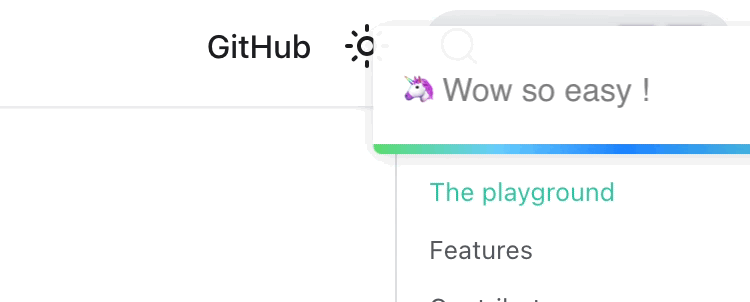

The [Notification Center](/notification-center/) example takes inspiration from the React Toastify library.

When you trigger a notification with a timeout with React Toastify, it displays a progress bar at the bottom of the notification.
When you hover the notification, the progress bar and the timer are paused, as shown below:



React Toastify uses a [CSS animation](https://developer.mozilla.org/en-US/docs/Web/CSS/CSS_animations),
defined with a [`@keyframes`](https://developer.mozilla.org/en-US/docs/Web/CSS/@keyframes).
The Notification Center does too:

```css
@keyframes progress-bar {
  0% {
    transform: scaleX(1);
  }

  100% {
    transform: scaleX(0);
  }
}
```

The animation is applied to the progress bar with CSS:

```jsx
<div
  className={css({
    // ...
    animationName: "progress-bar",
    animationFillMode: "forwards",
    animationIterationCount: 1,
    animationTimingFunction: "linear",
    transformOrigin: "left",
  })}
/>
```

React Toastify's implementation's beauty is using a CSS animation as a resumable timer.
A CSS animation can be paused with the [`animation-play-state`](https://developer.mozilla.org/en-US/docs/Web/CSS/animation-play-state) property.
The Notification Center uses the current state of the machine to determine when to stop the animation:

```tsx
<div
  style={{
    animationDuration: state.context.timeout! + "ms",
    animationPlayState:
      state.matches({ "Waiting for timeout": "Active" }) === true
        ? "running"
        : "paused",
  }}
/>
```

We can know when the animation ends thanks to the `animationend` event received by the animated element and close the notification:

```tsx
<div
  onAnimationEnd={() => {
    notificationRef.send({
      type: "animation.end",
    });
  }}
/>
```

The Notification Center example could have used a JavaScript timer, but it would have involved more code and increased complexity.
Relying on the browser led to a simple and robust solution. The animation can even [be stopped in the Dev Tools](https://firefox-source-docs.mozilla.org/devtools-user/page_inspector/how_to/work_with_animations/index.html#animation-playback)
without causing any bugs.

Check out the [Notification Center](/notification-center/) example to play with the animation. Hover over it to pause the animation.
